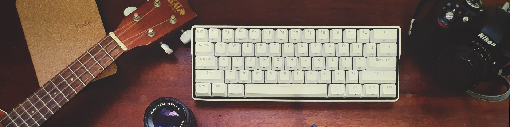

## Hi, I'm André 👋 Who goes there ? 😁 

<!--- So you also read others README.md files ? Welcome ! \o/ --->

---

<h1 align="center">
    
</h1>

---

I'm a graduated Mechanical Engineer 🌊 with emphasis in Computational Fluid Dynamics & Offshore 💨 that decided to land on Tech.
***(That Simulation guy) ...*** 🤓

Self-taught, I'm just an avid learner. 

I've experienced code through in-house software development and, now, working in a Data Mart.

- 🔁 I’m looking to dive into collaboration & Open Source
-  2021: Learn that new language
- 💻 Put myself on the map as a developer
  

**FAQ ( Funny Answers to "Quote me" )**

- 🐧 Linux since 2014
- 🌎 EN FR PT-BR
- 🎸 guitar / ukulele
- 📷 eventual photographer
- [:heavy_check_mark:] Tabs [ _ ] Spaces
- [:heavy_check_mark:] VIM [:heavy_check_mark:]  VS Code / OSS [ _ ] EMACS ... that other OS ... 😂
- [:heavy_check_mark:]  Semicolon [ _ ] No Semicolon
- [:heavy_check_mark:]  Linux [:heavy_check_mark:]  MacOS [:heavy_check_mark:]  WSL2 [ _ ] Windows 
- [:heavy_check_mark:]  Zsh [:heavy_check_mark:] Bash [ _ ] Fish [ _ ] PowerShell 

**_⚙️  Tools available at [dotfiles](https://github.com/andregda/dotfiles)_**

### Languages & Technologies:

But if you mean 🗣️ ... I use [SRS](https://en.wikipedia.org/wiki/Spaced_repetition), powered by
 
[Anki], books and movies/series shadowing.

### Certificates:

<!--- Rocketseat - Ignite nodeJS ---->

Rocketseat - Ignite NodeJS (Ongoing)

<!--- Coursera - IBM AI Engineering Specialization ---->
[][IBM - AI Engineering Specialization][IBM - AI Engineering Specialization]

<!--- Coursera - Deep Learning Specialization ---->
[][DeepLearning.ai - Deep Learning Specialization][DeepLearning.ai - Deep Learning Specialization]

<!--- Télécom Paris - Image processing in Python ---->
[][Télécom Paris - Image processing in Python][Télécom Paris - Image processing in Python]

<!--- [Rocketseat - Ignite NodeJS]:  --->
[IBM - AI Engineering Specialization]: https://coursera.org/share/ce8a91bf4a3899757188a891f786be0a
[DeepLearning.ai - Deep Learning Specialization]: https://www.coursera.org/account/accomplishments/specialization/certificate/7TMV6SUME7LG
[Télécom Paris - Image processing in Python]: https://raw.githubusercontent.com/andregda/andregda/main/assets/Image_Processing-TelecomParis.jpg

## Reach me over:

  <a href="https://andregda.github.io">
   

	

   
  

		@andregda && a.arroxellas@gmail.com && linkedin/a-arroxellas

---

<!--- Check the work of https://anuraghazra.github.io/case-studies/github-readme-stats --->
<!---
|  |  |
|:-:|:-:|
--->

<!--- Check the work of https://github.com/vn7n24fzkq/github-profile-summary-cards --->
|  |  |
|:-:|:-:|

	<!--- Check the work of https://github.com/antonkomarev/github-profile-views-counter --->
	
	
	

[anki]: https://github.com/ankitects/anki
[github]: https://github.com/andregda
[linkedin]: https://linkedin.com/in/a-arroxellas

---

Made by André Arroxellas 👋🏽 [Get in Touch!](Https://www.linkedin.com/in/a-arroxellas/)
